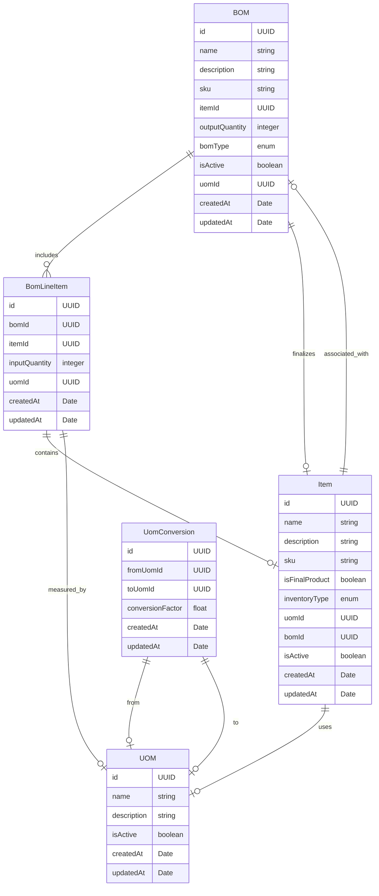

# Bill-of-material

## Overview

This template  provides a comprehensive design for the bill of material application. this app can also be used for Ingredients Management, Product Bundle, Kit, and Assortment Management..

## Usage
To deploy this template, run the following commands

```
make init
make apply
```

To gain further insight into the data structure, visit the [Tailor Console](https://console.tailor.tech) and explore the data schema using live sample data.

## Seed the initial data

1. Install dependencies in the templates folder

```
pnpm i
```

2. To seed the initial data into a deployed application run the following commands:

```bash
cd bom
node ../common/scripts/seed.mjs
```

## Sample GraphQL queries and mutations

Create a bill or material
```graphql
mutation billOfMaterial {
  createBom(input: {name: "Wheel", outputQuantity: 1}) {
    id
    name
    outputQuantity
  }
}
```


Create a item of bill of material
```graphql
mutation item {
  createItem(
    input: {name: "Rubber Tube", description: "Rubber tube used in wheel"}
  ) {
    id
    name
  }
}
```


## ERD for this application


