# Inventory Management System

## Overview

This template provides a comprehensive solution for managing inventory items.
For more details please visit [here](https://www.tailor.tech/templates/inventory-management-system).


## Deploy the app template

To deploy our app templates, you need tailorctl and a Tailor account.  
If you don’t have a Tailor account,
please [contact us](https://form.typeform.com/to/QONhVIuj?typeform-source=www.tailor.tech).

### Prerequisites

To install tailorctl and other dependencies, you can use homebrew.

```
brew install tailor-platform/tap/tailorctl
brew install coreutils yq cue gh
```

For more details, please visit our [documentation](https://docs.tailor.tech/getting-started/quickstart).

To get started with our app templates follow the steps below:

## Quick Start

### 1. Clone our app templates and install dependencies

```bash
git clone git@github.com:tailor-platform/templates.git
cd templates
pnpm i
```

### 2. Choose an app template

```bash
cd ims
```

### 3. Run the following commands to deploy the app

```bash
tailorctl workspace create -i # follow the interactive prompt
make init
make apply
make seed
```

### 4. Get the access token to use the GraphQL API in the playground

```bash
make machine-token
```

Please set the token in the Headers section of the playground as follows:
```json
{
  "Authorization": "bearer ${your_access_token}"
}
```

### 5. Finally, open the GraphQL playground to run queries

```
make app
```


## ERD for this application

```mermaid
erDiagram
    Contact {
        boolean active
        datetime createdAt
        string name
        string email
        string phone
        string address1
        string address2
        string city
        string province
        string country
        string zip
        string countryCode
        string company
        string provinceCode
        string quickBookCustomerId
        float openBalance
        float creditLimit
        datetime updatedAt
        float availableCredit
    }
    CostPool {
        boolean active
        datetime createdAt
        string name
        boolean isClosed
        datetime updatedAt
        datetime closedAt
    }
    CostPoolLineItem {
        boolean active
        datetime createdAt
        uuid costPoolID
        CostPool costPool
        string name
        float amount
        datetime updatedAt
        enum allocationBase
    }
    FinancialStockEvent {
        boolean active
        datetime createdAt
        uuid variantID
        ProductVariant variant
        float incrementalQuantity
        float unitCost
        float transactionTotalCost
        boolean isOnHold
        float onHoldQuantity
        float availableQuantity
        float inStockQuantity
        float totalCost
        float averageCost
        uuid receiptLineItemID
        ReceiptLineItem receiptLineItem
        uuid shipmentLineItemID
        ShipmentLineItem shipmentLineItem
        uuid operationalStockEventID
        datetime updatedAt
        OperationalStockEvent operationalStockEvent
    }
    FinancialStockSummary {
        boolean active
        datetime createdAt
        uuid variantID
        ProductVariant variant
        float onHoldQuantity
        float availableQuantity
        float inStockQuantity
        float totalCost
        datetime updatedAt
        float averageCost
    }
    InventoryItem {
        boolean active
        datetime createdAt
        string shopifyID
        uuid productVariantID
        datetime updatedAt
        ProductVariant productVariant
    }
    InventoryLevel {
        boolean active
        datetime createdAt
        uuid locationID
        Location location
        uuid inventoryItemID
        InventoryItem inventoryItem
        integer available
        integer committed
        integer reserved
        integer damaged
        integer safetyStock
        integer qualityControl
        integer onHand
        datetime updatedAt
        integer incoming
    }
    Invoice {
        boolean active
        datetime createdAt
        string invoiceNumber
        uuid customerID
        Contact customer
        uuid shipmentID
        Shipment shipment
        datetime date
        string quickbookInvoiceId
        enum invoiceStatus
        datetime updatedAt
        datetime pushedToQBAt
    }
    InvoiceLineItem {
        boolean active
        datetime createdAt
        uuid invoiceID
        Invoice invoice
        float unitPrice
        uuid variantID
        ProductVariant variant
        float quantity
        datetime updatedAt
        boolean taxable
    }
    Location {
        boolean active
        datetime createdAt
        string name
        datetime updatedAt
        string shopifyID
    }
    OperationalStockEvent {
        boolean active
        datetime createdAt
        uuid variantID
        ProductVariant variant
        float incrementalQuantity
        float unitCost
        float transactionTotalCost
        boolean isOnHold
        float onHoldQuantity
        float availableQuantity
        float inStockQuantity
        float totalCost
        float averageCost
        uuid receiptLineItemID
        ReceiptLineItem receiptLineItem
        uuid shipmentLineItemID
        ShipmentLineItem shipmentLineItem
        integer sequence
        datetime updatedAt
        boolean copiedToFinancialLedger
    }
    Product {
        boolean active
        datetime createdAt
        string shopifyID
        string title
        string handle
        string description
        uuid featuredImageID
        datetime updatedAt
        ProductImage featuredImage
    }
    ProductImage {
        boolean active
        datetime createdAt
        string shopifyID
        string url
        datetime updatedAt
        string altText
    }
    ProductVariant {
        boolean active
        datetime createdAt
        string shopifyID
        boolean availableForSale
        string barcode
        string sku
        string displayName
        uuid imageID
        ProductImage image
        integer inventoryQuantity
        float price
        uuid inventoryItemID
        InventoryItem inventoryItem
        uuid productID
        Product product
        boolean taxable
        enum inventoryType
        string quickbookItemId
        string quickbookSyncToken
        datetime updatedAt
        string quickbookItemName
    }
    PurchaseOrder {
        boolean active
        datetime createdAt
        string documentNumber
        uuid supplierID
        Contact supplier
        datetime date
        uuid billToID
        Contact billTo
        uuid shipToID
        Contact shipTo
        string shipVia
        string trackingNumber
        string shippingContactPhone
        string shippingContactName
        datetime exFactoryDate
        datetime dueDate
        string terms
        string shippingInstructions
        string notes
        string approvedBy
        string pulledBy
        datetime updatedAt
        string receivedBy
    }
    PurchaseOrderLineItem {
        boolean active
        datetime createdAt
        uuid purchaseOrderID
        PurchaseOrder purchaseOrder
        uuid variantID
        ProductVariant variant
        float quantity
        float unitCost
        datetime updatedAt
        float subtotalCost
    }
    Receipt {
        boolean active
        datetime createdAt
        string receiptNumber
        uuid supplierID
        Contact supplier
        uuid purchaseOrderID
        PurchaseOrder purchaseOrder
        datetime date
        datetime updatedAt
        enum receiptStatus
    }
    ReceiptLineItem {
        boolean active
        datetime createdAt
        uuid receiptID
        Receipt receipt
        uuid variantID
        ProductVariant variant
        float quantity
        float subtotalUnitCost
        float subtotalCost
        float cubicMeters
        costPools[] costPools
        float totalCostPoolAllocation
        float unitCostPoolAllocation
        float totalUnitCost
        enum receiptStatus
        datetime updatedAt
        datetime receivedAt
    }
    Role {
        string name
        datetime createdAt
        datetime updatedAt
    }
    SalesOrder {
        boolean active
        integer orderNumber
        uuid customerID
        Contact customer
        string shopifyID
        string cancelReason
        datetime cancelledAt
        string currency
        string currentSubtotalPrice
        string customerName
        string customerEmail
        datetime createdAt
        enum shipStationOrderStatus
        datetime updatedAt
        datetime shippedAt
    }
    SalesOrderLineItem {
        boolean active
        datetime createdAt
        string shopifyID
        uuid salesOrderID
        SalesOrder salesOrder
        uuid variantID
        ProductVariant variant
        float quantity
        float unitPrice
        float subtotalPrice
        float unitCompareAtPrice
        float discount
        string name
        string sku
        boolean requiresShipping
        boolean taxable
        datetime updatedAt
        enum fulfillmentStatus
    }
    Shipment {
        boolean active
        datetime createdAt
        string shipmentNumber
        uuid customerID
        Contact customer
        uuid salesOrderID
        SalesOrder salesOrder
        datetime updatedAt
        datetime date
    }
    ShipmentLineItem {
        boolean active
        datetime createdAt
        uuid shipmentID
        Shipment shipment
        float unitCost
        float unitPrice
        uuid variantID
        ProductVariant variant
        float quantity
        boolean taxable
        enum shipmentStatus
        datetime updatedAt
        datetime shippedAt
    }
    StockSummary {
        boolean active
        datetime createdAt
        uuid variantID
        ProductVariant variant
        float onHoldQuantity
        float availableQuantity
        float inStockQuantity
        float totalCost
        datetime updatedAt
        float averageCost
    }
    User {
        string name
        string email
        uuid[] roles
        datetime createdAt
        datetime updatedAt
    }


    CostPool ||--o{ CostPoolLineItem : costPool
    ProductVariant ||--o{ FinancialStockEvent : variant
    ReceiptLineItem ||--o{ FinancialStockEvent : receiptLineItem
    ShipmentLineItem ||--o{ FinancialStockEvent : shipmentLineItem
    OperationalStockEvent ||--o{ FinancialStockEvent : operationalStockEvent
    ProductVariant ||--o{ FinancialStockSummary : variant
    ProductVariant ||--o{ InventoryItem : productVariant
    Location ||--o{ InventoryLevel : location
    InventoryItem ||--o{ InventoryLevel : inventoryItem
    Contact ||--o{ Invoice : customer
    Shipment ||--o{ Invoice : shipment
    Invoice ||--o{ InvoiceLineItem : invoice
    ProductVariant ||--o{ InvoiceLineItem : variant
    ProductVariant ||--o{ OperationalStockEvent : variant
    ReceiptLineItem ||--o{ OperationalStockEvent : receiptLineItem
    ShipmentLineItem ||--o{ OperationalStockEvent : shipmentLineItem
    ProductImage ||--o{ Product : featuredImage
    ProductImage ||--o{ ProductVariant : image
    InventoryItem ||--o{ ProductVariant : inventoryItem
    Product ||--o{ ProductVariant : product
    Contact ||--o{ PurchaseOrder : supplier
    Contact ||--o{ PurchaseOrder : billTo
    Contact ||--o{ PurchaseOrder : shipTo
    PurchaseOrder ||--o{ PurchaseOrderLineItem : purchaseOrder
    ProductVariant ||--o{ PurchaseOrderLineItem : variant
    Contact ||--o{ Receipt : supplier
    PurchaseOrder ||--o{ Receipt : purchaseOrder
    Receipt ||--o{ ReceiptLineItem : receipt
    ProductVariant ||--o{ ReceiptLineItem : variant
    CostPool ||--o{ ReceiptLineItem : costPools
    User ||--o{ Role : roles


    Contact ||--o{ SalesOrder : customer
    SalesOrder ||--o{ SalesOrderLineItem : salesOrder
    ProductVariant ||--o{ SalesOrderLineItem : variant
    Contact ||--o{ Shipment : customer
    SalesOrder ||--o{ Shipment : salesOrder
    Shipment ||--o{ ShipmentLineItem : shipment
    ProductVariant ||--o{ ShipmentLineItem : variant
    ProductVariant ||--o{ StockSummary : variant
```

