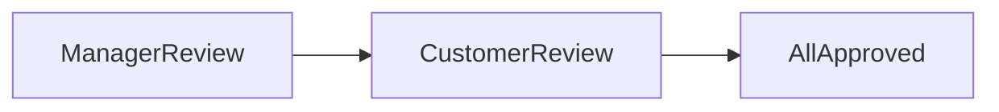

# Invoice

## Overview

This template provides a comprehensive solution for managing invoices.
This application supports both Issuer and Reviewer use case.

Access a demo application that utilizes this template and showcases various user views through the following links:

- [Customer view](https://tailorinc.retool.com/embedded/public/bb7736b7-de9c-4f12-beb9-f2f5d5fbc003)
- [Staff view](https://tailorinc.retool.com/embedded/public/d9fbb39c-a495-4fe4-9faf-a49976be6595)
- [Manager view](https://tailorinc.retool.com/embedded/public/5a90ce9c-22a8-4c80-a7ba-3f486eda735d)


## Deploy the app template

To deploy our app templates, you need tailorctl and a Tailor account.  
If you don’t have a Tailor account,
please [contact us](https://form.typeform.com/to/QONhVIuj?typeform-source=www.tailor.tech).

### Prerequisites

To install tailorctl and other dependencies, you can use homebrew.

```
brew install tailor-platform/tap/tailorctl
brew install coreutils yq cue gh
```

For more details, please visit our [documentation](https://docs.tailor.tech/getting-started/quickstart).

To get started with our app templates follow the steps below:

## Quick Start

### 1. Clone our app templates and install dependencies

```bash
git clone git@github.com:tailor-platform/templates.git
cd templates
pnpm i
```

### 2. Choose an app template

```bash
cd invoice
```

### 3. Run the following commands to deploy the app

```bash
tailorctl workspace create -i # follow the interactive prompt
make init
make apply
make seed
```

### 4. Get the access token to use the GraphQL API in the playground

```bash
make machine-token
```

Please set the token in the Headers section of the playground as follows:
```json
{
  "Authorization": "bearer ${your_access_token}"
}
```

### 5. Finally, open the GraphQL playground to run queries

```
make app
```


## Sample GraphQL queries and mutations

Create a new invoice record.
```graphql
mutation ($invoiceName: String!, $quote: Int!) {
  createInvoice(input: { invoiceName: $invoiceName, quote: $quote }) {
    id
  }
}
```

Initiate a review process for an invoice.
```graphql
mutation ($invoiceID: ID!) {
  reviewInvoice(input: { invoiceID: $invoiceID }) {
    id
  }
}
```

Approve an invoice to proceed a review.
```graphql
mutation ($invoiceID: ID!, $stateID: ID!) {
  approveInvoice(input: { stateID: $stateID, invoiceID: $invoiceID }) {
    success
  }
}
```

### Invoice review status transition

Once you create an invoice, you can initiate the business operation to let the manager and customer review the invoice with the `reviewInvoice` mutation. When the review process is initiated, the review state becomes `ManagerReview`.
At this state, users who have either a Manager or Staff role can read the invoice, and only users who have a Manager role can update the invoice. Also, the manager can only approve the invoice with the `approveInvoice` mutation.
If the manager approves the invoice, the state will be updated to `CustomerReview` from `ManagerReview`. At this state, users who have a customer role can approve the invoice. When the customer approves the invoice, the review process is done, and the state becomes `AllApproved`. At this state, the invoice record will be read-only, and no more updates are applicable.

