# manufacturing-order

## Overview

This template provides a comprehensive design for the Manufacturing Order (MO) module, integrating Bill of Materials (BOM), Work Order (WO), and optionally with Inventory Management Systems (IMS) and Sales Order/Purchase Order (SO/PO) systems. It aims to facilitate the creation, management, and tracking of manufacturing orders, ensuring efficient production processes. The document includes details on key features, models, user stories, entity relationships, interfaces, and functions required for the MO module.

## Usage
To deploy this template, run the following commands

```
make init
make apply
```

To gain further insight into the data structure, visit the [Tailor Console](https://console.tailor.tech) and explore the data schema using live sample data.

## Seed the initial data

1. Install dependencies in the templates folder

```
pnpm i
```

2. To seed the initial data into a deployed application run the following commands:

```bash
cd manufacturing_order
node ../common/scripts/seed.mjs
```

## Sample GraphQL queries and mutations

Create a manufacturing order
```graphql
mutation MyMutation {
  createManufacturingOrderAndWorkOrders(
    input: {bomId: "69493a13-e2ea-5188-9258-441c3061b625", quantity: 5, name: "Abs Modulator"}
  ) {
    manufacturingOrderId
  }
}
```


Create a item of manufacturing order
```graphql
mutation MyMutation {
  planManufacturingOrder(
    input: {manufacturingOrderId: "0e13ddb1-2b43-4677-806e-eba5f6979a59", scheduleDateTime: "2024-10-10T13:55:20Z"}
  ) {
    success
  }
}
```


## ERD for this application

```mermaid
erDiagram
    Item {
        string id PK
        string name
        string description
        string productId
        boolean isFinalProduct
        InventoryType inventoryType
        string uomId FK
    }

    UOM {
        string id PK
        string name
        string description
    }

    UOMConversion {
        string id PK
        string fromUOMId FK
        string toUOMId FK
        number conversionFactor
    }

    BOM {
        string id PK
        string name
        string description
        string itemId FK
        number outputQuantity
        BOMType bomType
    }

    BOMLineItem {
        string id PK
        string bomId FK
        string itemId FK
        number inputQuantity
        string uomId FK
        number unitCost
        number totalCost
        boolean isManufactured
    }

    ManufacturingOrder {
        string id PK
        string item
        string manufacturingOrderName
        date scheduledDate
        string scheduledTime
        string bomId FK
        string componentsStatus
        number quantity
        ManufacturingOrderStatus status
        date createdAt
        date updatedAt
        number totalCost
        number bomCost
        number woCost
        ManufacturingOrder parentMOId FK
    }

    MO_WO_Plan {
        string moId FK
        string woId FK
        string workCenterId FK
        number sequence
        date startDate
        date endDate
    }

    DayOfWeek {
        enum Sunday
        enum Monday
        enum Tuesday
        enum Wednesday
        enum Thursday
        enum Friday
        enum Saturday
    }

    WorkOrderStatus {
        enum Waiting_for_another_WO
        enum Waiting_for_components
        enum Ready
        enum In_Progress
        enum Finished
        enum Blocked
    }

    ManufacturingOrderStatus {
        enum Created
        enum In_Progress
        enum WO_Completed
        enum Completed
        enum Cancelled
    }

    Employee {
        id ID
        name string
        role string
    }

    WorkingHours {
        id ID
        name string
        standardHoursPerWeek number
        timeZone string
        isActive boolean
    }

    DailySchedule {
        id ID
        workingHoursId ID
        dayOfWeek DayOfWeek
        workFrom string
        workTo string
        duration number
    }

    WorkCenter {
        id ID
        name string
        description string
        code string
        workingHoursId ID
        timeEfficiency number
        parallelProcessingLimit number
        setupTime number
        cleanupTime number
        hourlyProcessingCost number
        hourlyCostPerEmployee number
        isActive boolean
    }

    Operation {
        id ID
        name string
        bomId ID
        workCenterId ID
        duration number
        description string
        documentUrl string
        isActive boolean
    }

    WorkOrder {
        id ID
        status WorkOrderStatus
        operationId ID
        workCenterId ID
        expectedDuration number
        realDuration number
        isBlocked boolean
        isDeleted boolean
        startDate Date
        endDate Date
    }

    WOTimeTracking {
        workOrderId ID
        employeeId ID
        duration number
        startDate Date
        endDate Date
    }

    Item ||--o{ UOM : "measured in"
    Item ||--o{ BOM : "produced by"
    BOM ||--o{ BOMLineItem : "has"
    BOMLineItem ||--o{ Item : "uses"
    BOMLineItem ||--o{ UOM : "measured in"
    UOM ||--o{ UOMConversion : "converted from"
    UOM ||--o{ UOMConversion : "converted to"
    ManufacturingOrder ||--o{ ManufacturingOrder : "has nested MOs"
    ManufacturingOrder ||--|| BOM : "based on"
    ManufacturingOrder ||--o{ MO_WO_Plan : "has"
    MO_WO_Plan ||--o{ WorkOrder : "contains"
    WorkOrder ||--|| BOM : "based on"
    WorkOrder ||--|| WorkCenter : "executed at"
    WorkOrder ||--|| Operation : "based on"
    WOTimeTracking ||--|| WorkOrder : "tracks"
    WOTimeTracking ||--|| Employee : "worked by"
    WorkingHours ||--o{ DailySchedule : "has"
    DailySchedule }o--|| DayOfWeek : "on"
    WorkCenter ||--|| WorkingHours : "uses"
    Operation ||--|| BOM : "uses"
    Operation ||--|| WorkCenter : "performed at"
    WorkOrder ||--|| Operation : "based on"
    WorkOrder ||--|| WorkCenter : "executed at"
    WOTimeTracking ||--|| WorkOrder : "tracks"
    WOTimeTracking ||--|| Employee : "worked by"
```


