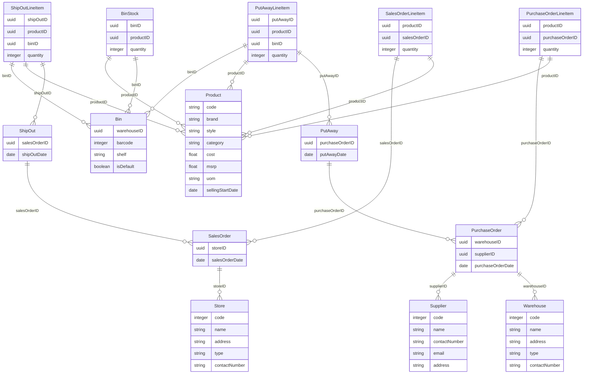

# warehouse management

## Overview
Features

## Database Schema


## Usage
WIP

To seed the initial data for your application, run these commands.
```bash
tailorctl app login -u '$owner_username' -p '$owner_password' #your workspace owner name and password
tailorctl app import -m charts --auto-approve
```


