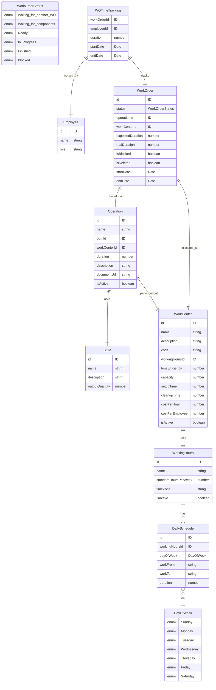

# Work-Order

## Overview

This template  provides a comprehensive design for the Work Order application. The application will integrate with Inventory Management Systems (IMS), Purchase Order/Sales Order (PO/SO) systems, and Bill of Materials (BOM) applications to facilitate the creation, management, and tracking of work orders.

## Usage
To deploy this template, run the following commands

```
make init
make apply
```

To gain further insight into the data structure, visit the [Tailor Console](https://console.tailor.tech) and explore the data schema using live sample data.

## Seed the initial data

1. Install dependencies in the templates folder

```
pnpm i
```

2. To seed the initial data into a deployed application run the following commands:

```bash
cd work_order
node ../common/scripts/seed.mjs
```

## Sample GraphQL queries and mutations

Get real and expected duration of work order
```graphql
query aggregateWorkOrder {
  aggregateWorkOrders {
    sum {
      realDuration
      expectedDuration
    }
  }
}
```


## ERD for this application
